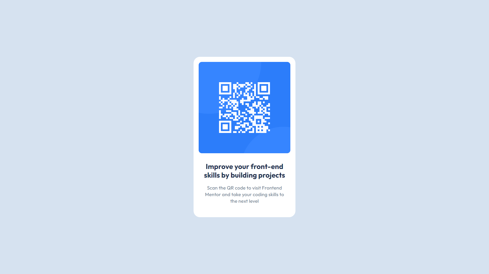

# Frontend Mentor - QR code component solution

This is a solution to the [QR code component challenge on Frontend Mentor](https://www.frontendmentor.io/challenges/qr-code-component-iux_sIO_H). Frontend Mentor challenges help you improve your coding skills by building realistic projects. 

## Table of contents

- [Overview](#overview)
  - [Screenshot](#screenshot)
  - [Links](#links)
- [My process](#my-process)
  - [Built with](#built-with)
  - [Continued development](#continued-development)
  - [Useful resources](#useful-resources)
- [Author](#author)
- [Acknowledgments](#acknowledgments)

## Overview

### Screenshot

### Links

- Solution URL: [GitHub](https://github.com/shwerts/qr-code-component)
- Live Site URL: [GitHub Pages](https://shwerts.github.io/qr-code-component/)

## My process

### Built with

- Semantic HTML5 markup
- Flexbox

### Continued development

Will continue to learn more about Flexbox & Grid, custom variables and eventually build more projects

### Useful resources

- [Fareed's solution](https://www.frontendmentor.io/solutions/qr-code-component-using-html-and-css-B5LPEOKEk4) - He was an example for me when I was finishing submitting my own solution

## Author

- Frontend Mentor - [@shwerts](https://www.frontendmentor.io/profile/shwerts)

## Acknowledgments

I'll be very kind if someone gives me any feedback
